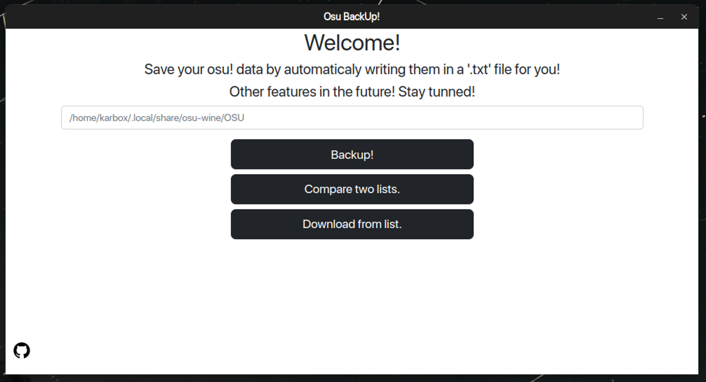
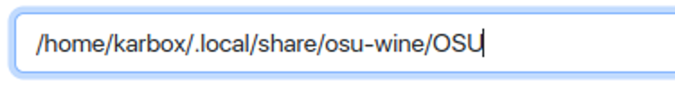
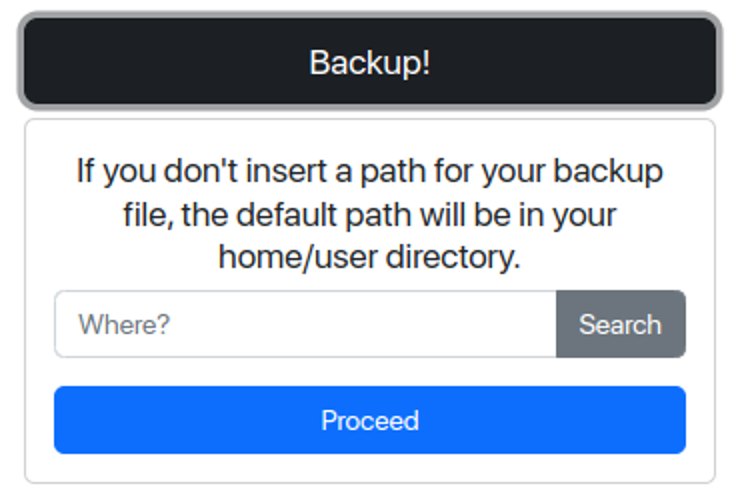
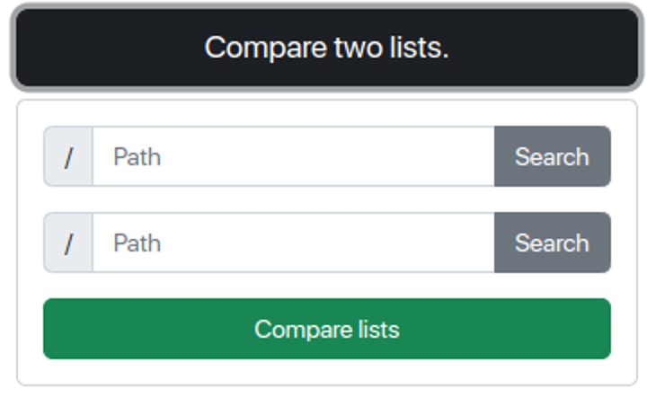

<h1 align='center'>BackOsu is designed to backup and download all your osu! songs. </h1>

<div align='center'>
  
  <h2>Powered by <a href='https://www.electronjs.org'>Electron</a>.</h2>
</div>

<br>

### README
[Português Brasileiro](https://github.com/KarboXXX/backosu/blob/main/README.pt-br.md),
[English](https://github.com/KarboXXX/backosu/blob/main/README.md)

## Interface



From there, you can simply either backup your data, compare two different backups, or download your songs with ease.

## How to use
When typing your **osu! path**, the default osu! folder is shown by default, in case you dont know where it is. *We'll warn you if [we don't know either](https://github.com/KarboXXX/backosu/issues).*



When **backing up**, you can select the folder you want the backup to be created in, no worries with backing up using an external drive. *(although the backup is just a text file with names and download links)*



When **comparing two lists**, you'll need to select two files, giving their path, either by typing, or clicking "**Search**" and selecting them.



-----

## Installing
Now it's up to you if you want to install the [latest release](https://github.com/KarboXXX/backosu/releases) or [build using the source code](https://github.com/KarboXXX/backosu#building-from-source). Any bugs related to compiled releases instalation, please [report an issue](https://github.com/KarboXXX/backosu/issues).

Note that all songs that can be backed up are ranked ones, no unranked songs can be backed up at the moment. If you know a mirror server that contains unranked beatmaps, or another method of link direct downloads using plain text, [let us know and eli5](https://github.com/KarboXXX/backosu/issues).

-----

## Building from source
### Windows
- install dependecies to compile/run the project.: [npm](https://docs.npmjs.com/downloading-and-installing-node-js-and-npm) & [git](https://git-scm.com/download/win)

- Open CMD using <kbd>Win</kbd> + <kbd>R</kbd> and typing 'cmd', or through Windows Search.

- Go to your Downloads folder using the 'cd' command, and then run: 
```
git clone https://github.com/KarboXXX/backosu.git
cd backosu
npm install
npm run dist
```

-----

### Linux (Debian & Ubuntu-based distros)
- Open terminal with <kbd>Ctrl</kbd> + <kbd>Alt</kbd> + <kbd>T</kbd>

- install package dependencies with 
  ```sudo apt install npm git```

- go to your Downloads folder and run: 
  ```git clone https://github.com/KarboXXX/backosu.git && cd backosu```

- install project dependencies with: 
  ```npm install```

- for running, stick with ```npm start```, for compiling, ```npm run dist```

-----

### Linux (Arch-based distros)
- Open the terminal with <kbd>Ctrl</kbd> + <kbd>Alt</kbd> + <kbd>T</kbd>
  
- install package dependencies with 
  ```sudo pacman -Syu npm git zenity kdialog xdialog```
  
- Go to your Downloads folder and run: 
  ```git clone https://github.com/KarboXXX/BackOsu.git && cd BackOsu```
  
- install project dependencies with 
  ```npm install```
  
- for running, stick with ```npm start```, for compiling, ```npm run dist```


If compiling does not work for some reason, please [report an issue](https://github.com/KarboXXX/backosu/issues).
