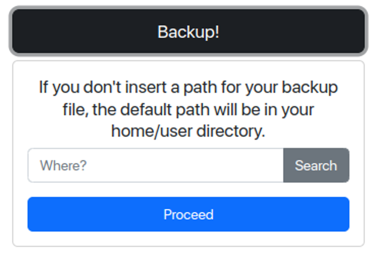

<h1 align='center'>BackOsu é pensado para fazer backup e baixar todas suas músicas osu!.</h1>

<div align='center'>
  
  <h2>Feito com <a href='https://www.electronjs.org'>Electron</a>.</h2>
</div>

<br>
<br>

## Interface


Daqui, você pode simplesmente fazer backup de seus dados, comparar dois backups diferentes ou baixar suas músicas com facilidade.

## Como usar
Quando inserir seu **diretório do osu!**, O caminho padrão do osu! será mostrado, caso você não saiba onde ele está. *Nós vamos avisar você se [nós também não soubermos](https://github.com/KarboXXX/backosu/issues).*


Quando **estiver fazendo backup**, você pode selecionar a pasta aonde você gostaria que o backup seja criado, sem preocupações criando backup com um disco rígido externo. *(Apesar do backup ser apenas um arquivo de texto com os nomes e os links de download.)*



Quando **estiver comparando duas listas**, você vai precisar selecionar dois arquivos, inserindo os seus caminhos, seja digitando ou clicando em "**Search**" e os selecionando.


-----

## Instalando
Agora cabe a você se você quer instalar a [última versão](https://github.com/KarboXXX/backosu/releases) ou [compilar usando o código fonte](https://github.com/KarboXXX/backosu#building-from-source). Qualquer bug relacionado a instalação das versões compiladas, por favor [reporte um problema](https://github.com/KarboXXX/backosu/issues).

Note que todas as músicas que podem ser feitas backups, são somente as ranqueadas, músicas não ranqueadas não são possíveis no momento. Se você souber um servidor espelhado que contêm mapas não ranqueados, ou outro método de link direto usando texto simples [nos avise](https://github.com/KarboXXX/backosu/issues).

-----

## Compilando do código
### Windows
- instale as dependências para compilar/rodar o projeto: [npm](https://docs.npmjs.com/downloading-and-installing-node-js-and-npm) & [git](https://git-scm.com/download/win)

- Abra o CMD usando <kbd>Win</kbd> + <kbd>R</kbd> e digitando 'cmd', ou pela Pesquisa do Windows.

- Vá para sua pasta Downloads usando o comando 'cd', e depois execute: 
```
git clone https://github.com/KarboXXX/backosu.git
cd backosu
npm install
npm run dist
```

-----

### Linux (Distribuições baseadas em Debian & Ubuntu)
- Abra o terminal com <kbd>Ctrl</kbd> + <kbd>Alt</kbd> + <kbd>T</kbd>

- instale as dependências de pacotes com 
  ```sudo apt install npm git```

- vá para sua pasta Downloads e execute: 
  ```git clone https://github.com/KarboXXX/backosu.git && cd backosu```

- instale as dependências do projeto com: 
  ```npm install```

- para executar, use ```npm start```, para compilar, ```npm run dist```

-----

### Linux (Distribuições baseada em Arch)
- Abra o terminal com <kbd>Ctrl</kbd> + <kbd>Alt</kbd> + <kbd>T</kbd>
  
- instale as dependências de pacotes com 
  ```sudo pacman -Syu npm git zenity kdialog xdialog```
  
- vá para sua pasta Downloads e execute:
  ```git clone https://github.com/KarboXXX/BackOsu.git && cd BackOsu```
  
- instale as dependências do projeto com:
  ```npm install```
  
- para executar, use ```npm start```, para compilar, ```npm run dist```


Se a compilação não funcionar por algum motivo, por favor [reporte um problema](https://github.com/KarboXXX/backosu/issues).
